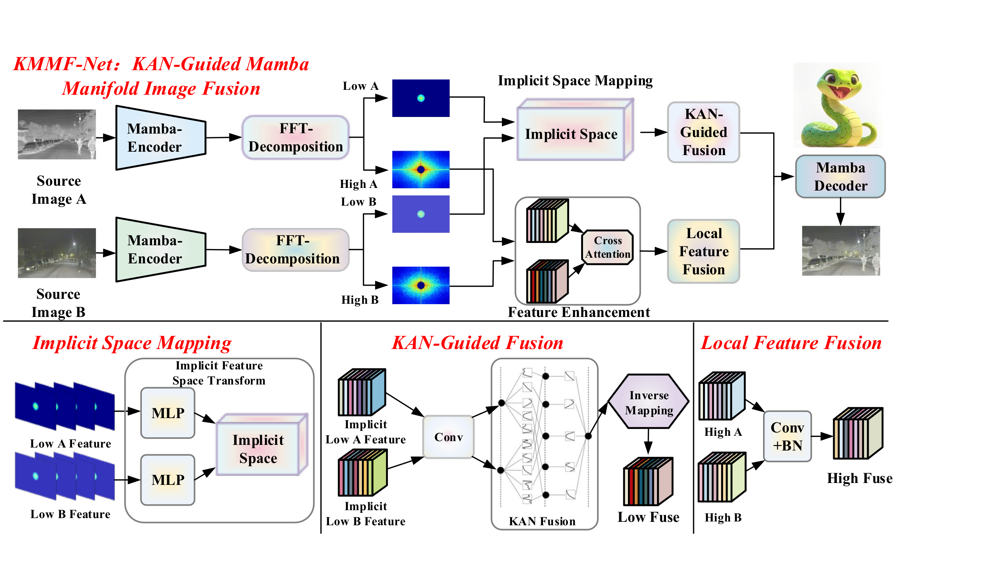
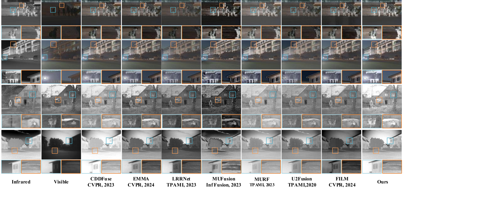
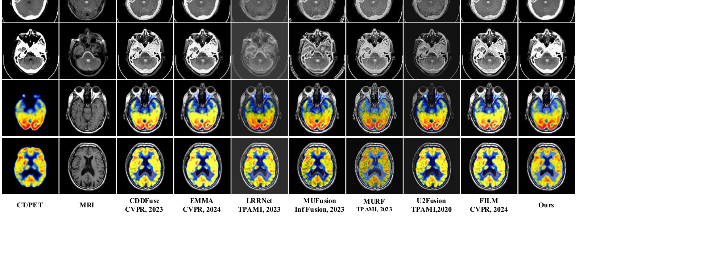
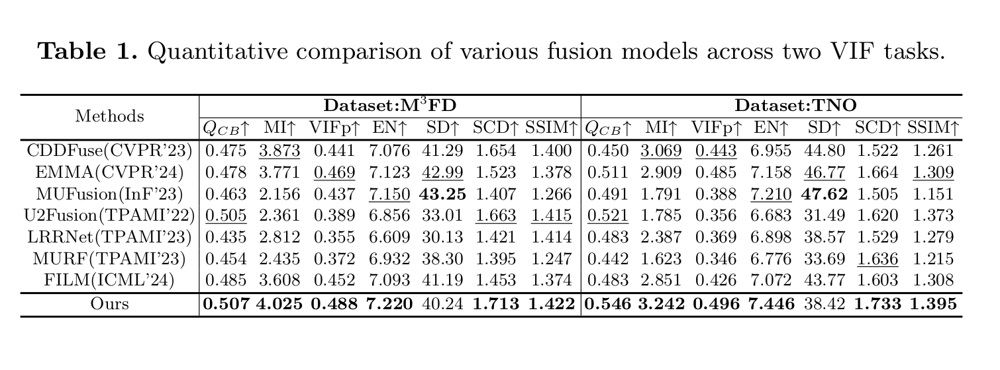
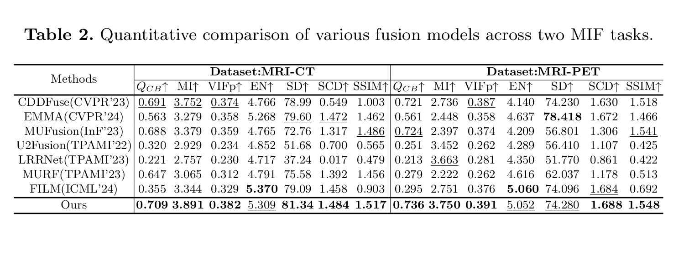

# KMMF-Net

PyTorch implementation of our PRCV 2025 paper **KMMF-Net: Implicit Fusion
with KAN-Guided Mamba Modeling** for infrared-visible and medical image fusion.

KMMF-Net combines modality-specific Mamba encoders, differentiable frequency
decomposition, KAN-guided low-frequency fusion, bidirectional high-frequency
cross-attention, and a Mamba decoder. All training and inference paths operate
on luminance tensors in `[0, 1]`; visible or PET chroma is restored only when
saving a color result.

## Architecture

<p align="center">
  
</p>

KMMF-Net first extracts modality-specific features with two Mamba encoders and
decomposes them into low- and high-frequency components. Low-frequency
structure is aligned in an implicit space and fused by KAN, while
high-frequency detail is enhanced through cross-attention and local feature
fusion. A Mamba decoder reconstructs the final fused image.

**Main components:**

- **Mamba encoders/decoder** model long-range dependencies efficiently.
- **FFT decomposition** separates global structure from texture and edges.
- **Implicit space mapping + KAN fusion** handles nonlinear cross-modal gaps.
- **High-frequency cross-attention** preserves salient targets and fine detail.

The repository provides two Mamba backends:

- `official`: official VMamba `VSSBlock` with selective scan, intended for
  Linux/CUDA formal training.
- `lite`: portable directional-convolution fallback for Windows, debugging,
  and the included MSRS checkpoint. It is not a replacement for SS2D.

## Qualitative Results

### Infrared and Visible Image Fusion

<p align="center">
  
</p>

KMMF-Net preserves salient thermal targets while retaining visible-light
background structure, texture, and local contrast on the VIF task.

### Medical Image Fusion

<p align="center">
  
</p>

For CT-MRI and PET-MRI fusion, KMMF-Net jointly retains anatomical structure,
soft-tissue detail, and functional color information.

## Quantitative Results

### Infrared and Visible Fusion

<p align="center">
  
</p>

### Medical Image Fusion

<p align="center">
  
</p>

The complete model achieves the strongest overall performance across the
M3FD, TNO, MRI-CT, and MRI-PET evaluations, with leading results on most
reported quality, information, structural, and similarity metrics.

## Repository Layout

```text
KMMF-Net-Release/
|-- configs/          # MSRS, medical, lite, and smoke configurations
|-- datasets/         # paired image discovery, validation split, augmentation
|-- losses/           # weighted intensity and signed Sobel fusion loss
|-- models/           # KMMF-Net, FFT, KAN, attention, VMamba adapter
|-- scripts/          # environment setup and dataset inspection
|-- third_party/      # pinned VMamba source and its original license
|-- checkpoints/      # compact MSRS inference checkpoint
|-- train.py
|-- test.py
`-- smoke_test.py
```

## Installation

### Linux / official VMamba

```bash
conda create -n kmmf python=3.10 -y
conda activate kmmf
bash scripts/setup_linux.sh
```

### Windows / portable lite backend

```powershell
conda create -n kmmf python=3.10 -y
conda activate kmmf
powershell -ExecutionPolicy Bypass -File scripts/setup_windows.ps1
```

Run the dependency and backward-pass check:

```bash
python smoke_test.py
```

## Data Layout

Images in paired directories must have identical filenames and spatial sizes.
Data is not distributed with this repository.

MSRS:

```text
data/MSRS_train/
|-- vi/
`-- ir/
```

Medical:

```text
data/medical/Train/
|-- CT_MRI/
|   |-- MRI/
|   `-- CT/
|-- MRI_PET_150/
|   |-- mri_part/
|   `-- pet_part/
`-- PET_MRI_1614/
    |-- MRI/
    `-- PET/
```

Validate all pairs before training:

```bash
python scripts/inspect_dataset.py --config configs/msrs.yaml
python scripts/inspect_dataset.py --config configs/medical.yaml
```

Use `--data-root /path/to/dataset` with `train.py` or
`scripts/inspect_dataset.py` to override the YAML path without editing it.

## Fusion Loss

The released training objective is:

```text
L_int = MSE(w_vis * (Y_vis - Y_f), 0) + MSE(w_ir * (Y_ir - Y_f), 0)
G*    = source Sobel response with the larger absolute magnitude
L_grad = L1(Sobel_x(Y_f), G*_x) + L1(Sobel_y(Y_f), G*_y)
L_total = lambda_int * L_int + lambda_grad * L_grad
```

Gradient selection preserves the sign of the selected source response. The
provided MSRS configuration uses `w_vis = w_ir = 0.5` because no downstream
task labels are required by this release.

## Inference

The bundled checkpoint matches `configs/msrs_lite.yaml` exactly:

```bash
python test.py \
  --config configs/msrs_lite.yaml \
  --checkpoint checkpoints/kmmf_msrs_lite_best.pt \
  --source-a data/MSRS_train/vi \
  --source-b data/MSRS_train/ir \
  --color-from a \
  --output outputs/msrs_test
```

For a single pair, pass two image paths instead of directories. Use
`--color-from gray` to save grayscale fusion or `--color-from b` to retain the
second modality's chroma.

The bundled checkpoint produces the following validation preview (visible
luminance, infrared input, and fused output from left to right):


## Training

Paper-style Linux training with official VMamba:

```bash
python train.py --config configs/msrs.yaml
```

Portable training using the same architecture as the bundled checkpoint:

```bash
python train.py --config configs/msrs_lite.yaml
```

Initialize a new run from the bundled model weights:

```bash
python train.py \
  --config configs/msrs_lite.yaml \
  --pretrained checkpoints/kmmf_msrs_lite_best.pt
```

Resume a full training checkpoint containing optimizer and scheduler state:

```bash
python train.py --config configs/msrs_lite.yaml --resume outputs/msrs_lite/checkpoints/latest.pt
```

Training writes `best.pt`, `latest.pt`, validation triplets, the resolved YAML,
and JSONL metrics under the configured `output_dir`.

## Third-Party Code

The vendored VMamba file is pinned to commit
`2ed52ead062a51a64521ed3871d52914bf532876` and retains its original license.
Formal KAN fusion uses `pykan==0.2.8`. See [third_party/README.md](third_party/README.md).

## Citation

Please cite the KMMF-Net paper when using this repository. The final BibTeX
entry will be added after the publication metadata is available.

## License

The original code in this repository is released under the MIT License. The
vendored VMamba component remains subject to its included upstream license.
